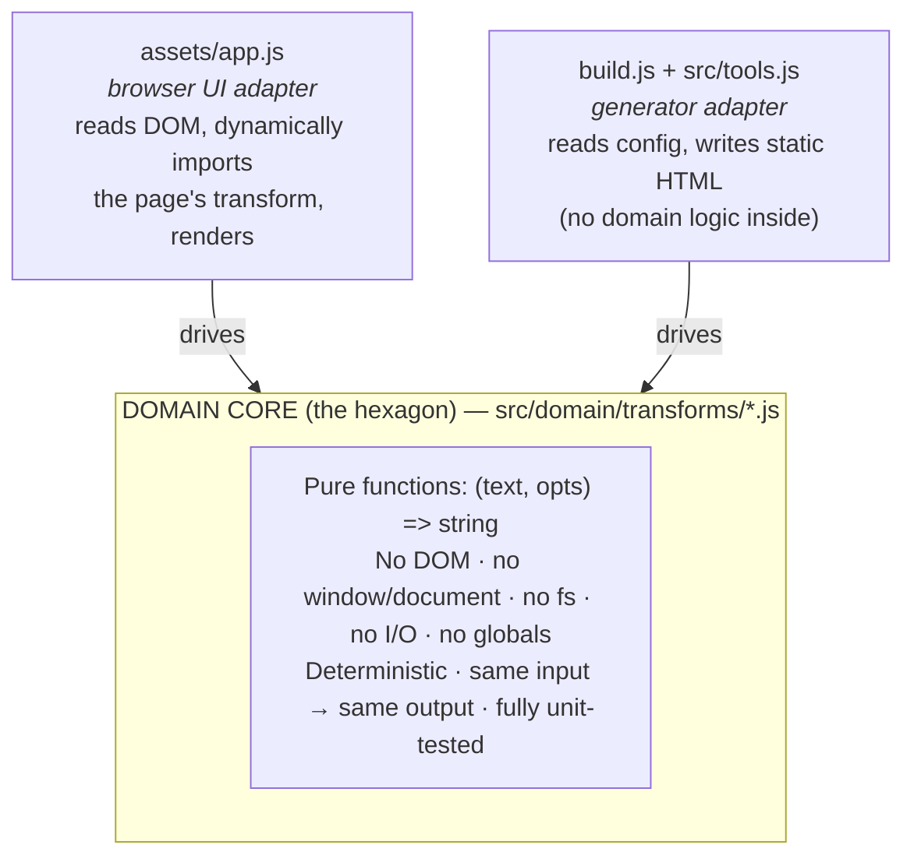

# TextTidy — Architecture & Development Rules

The conventions that keep this codebase small and consistent. Contributors (human or AI) should
follow them.

TextTidy is a static, client-side text-tools hub: a dependency-free Node generator
(`build.js`) stamps SEO pages from data (`src/tools.js`) around a set of pure text
transforms. Keep it that way — **zero runtime/build dependencies, vanilla JS, no framework.**

---

## 1. Architecture — Hexagonal (Ports & Adapters)

The value of this project lives in **pure text transforms**. Everything else (DOM, file
generation) is an adapter around that core. Enforce the boundary:



**The port** is the transform contract: `(text, opts) => string`, pure and total (never
throws for ordinary input; validation errors surface as a thrown `Error` the UI adapter
catches — see the find-and-replace regex case).

**Rules:**
- Domain transforms MUST NOT reference `document`, `window`, `navigator`, `localStorage`,
  `fs`, or any environment API. If a transform needs config, it comes in via `opts`.
- Transforms MUST be importable in **both** Node (for tests) and the browser. Author them as
  the single source of truth; the browser adapter imports them — never fork the logic.
- Adapters (`app.js`, `build.js`) hold ALL I/O and orchestration and NO business rules.
- `src/tools.js` is configuration/metadata (slugs, SEO copy, option schemas) — not logic.
- Apply hexagonal **only to the transform core**. Do not wrap the static generator or the
  CSS/theme toggle in ports/adapters ceremony — that is over-engineering for a static site.

## 2. Domain-Driven Design — where appropriate

This is a small, technical (generic-subdomain) tool site. Use the **lightweight** tactical
tools and skip the heavyweight ones.

**Apply:**
- **Ubiquitous language.** Use these terms everywhere (code, tests, copy, commits):
  *Tool* (a named utility), *Transform* (the pure operation a tool performs),
  *Option* (a typed parameter: `checkbox` | `select` | `text`), *Registry* (slug → transform
  map). Name functions and tests in this language.
- **Value objects / pure functions.** Transforms are stateless value-transformations. Model
  option sets as plain data objects; keep them immutable within a transform.
- **Domain integrity.** A tool's option schema in `src/tools.js` and the options its
  transform reads MUST stay in lockstep. Adding/renaming an option touches both, plus tests.

**Do NOT apply** (no fit here — avoid the anemic-ceremony trap): aggregates, entities with
identity, repositories, domain events, unit-of-work, a message bus. There is no persistence
and no long-lived state. If you feel the urge to add one, you are over-modeling — stop.

## 3. Testing — 100% unit coverage is mandatory

- **Target: 100% coverage (statements, branches, functions, lines) of the domain core**
  (`src/domain/**`). This is a hard gate, not a goal. Adapters are kept thin precisely so the
  meaningful logic is unit-testable without a browser.
- **Tooling:** Node's built-in runner + coverage only (keep zero deps):
  `node --test --experimental-test-coverage`. Tests live in `test/` as `*.test.js` and
  import transforms directly from `src/domain/`.
- **TDD (red → green → refactor).** For any transform change or new tool, write the failing
  test first, then the implementation.
- **Cover every branch.** Each transform has options → each option state (and each `select`
  choice) is a branch that MUST be exercised, including:
  - the default option set,
  - each boolean option on AND off,
  - every `select` value,
  - edge cases: empty string, whitespace-only, single line vs multi-line, Unicode/emoji
    (surrogate pairs), CRLF vs LF line endings, and the documented error path
    (e.g. invalid regex in find-and-replace must throw).
- **Test names use the ubiquitous language**, e.g.
  `remove-extra-spaces: collapses runs of spaces to one when 'collapse' is on`.
- Assert on exact output strings — these are deterministic pure functions; no snapshots, no
  mocks (there is nothing to mock in a pure core).
- A change that drops domain coverage below 100% is **not done**. Fix the test or the code.

## 4. Adding or changing a tool (the required workflow)

1. Add/adjust the tool's metadata + option schema in `src/tools.js` (copy stays
   **unique** per tool — never boilerplate; duplicate content is both a quality and a legal
   problem).
2. Write failing unit tests in `test/<slug>.test.js` covering every option branch and the
   edge cases above.
3. Implement the pure transform in `src/domain/transforms/<slug>.js` and register it in the
   transform registry. Make the tests pass.
4. The browser adapter and generator pick it up automatically via the registry/config — do
   not hand-wire per-tool UI or duplicate the logic in `app.js`.
5. Run the build and exercise the tool in a browser before considering it done (see §6).

## 5. Code style & constraints

- Vanilla ES, no dependencies, no bundler. Small, pure, readable functions.
- Match the surrounding style (the existing `assets/app.js` idiom): guard clauses over deep
  nesting, no cleverness that obscures intent.
- Accessibility and the System/Light/Dark theme contract are part of the UI adapter — keep
  the no-flash inline head script and `prefers-color-scheme` behavior intact.
- Never send user text off-device. In-browser processing is a core promise; no network I/O
  in any adapter for tool operation.

## 6. Definition of Done

A change is done only when ALL hold:
- [ ] Domain logic is a pure transform in `src/domain/`, free of DOM/I/O.
- [ ] Unit tests cover every branch; `node --test` passes; **domain coverage is 100%**.
- [ ] Option schema (`src/tools.js`) and transform options agree.
- [ ] `node build.js` succeeds; the tool works when exercised in a real browser.
- [ ] SEO copy is unique; nav/homepage/sitemap include the tool.
- [ ] No new dependencies introduced.

---

## 7. How the pieces connect (current, enforced layout)

```
src/domain/util.js                 pure helpers (splitLines, escapeRegExp)
src/domain/transforms/<slug>.js    one pure transform each: export function transform(text, o)
src/domain/registry.js             slug → transform map (build-time integrity check)
src/tools.js                       tool metadata + option schemas (config, no logic)
src/site.js                        brand/domain config
assets/app.js                      web adapter: imports /domain/util.js, dynamically
                                   imports /domain/transforms/<slug>.js per page
build.js                           generator: validates every tool has a transform,
                                   copies src/domain → dist/domain (served for import)
test/<slug>.test.js                unit tests importing transforms directly
```

- The browser loads `/assets/app.js` as a **module** and does a per-page
  `import('/domain/transforms/<slug>.js')` — each page ships only its own transform.
- `node --test --experimental-test-coverage` currently reports **100%** line/branch/function
  coverage across `src/domain/**`. Keep it there — it's a merge gate, not a goal.
- Node runs ESM (`"type": "module"` in package.json); `.js` files are shared verbatim between
  Node tests and the browser (no bundler, no transpile).
