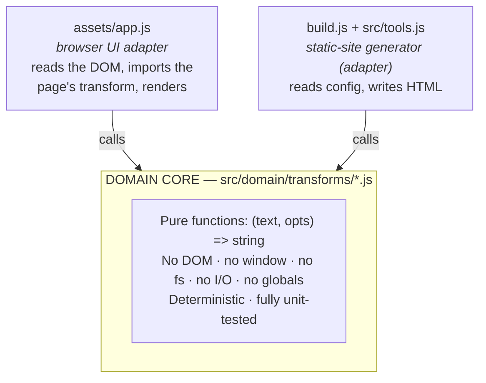

# TextTidy

**Fast, private text tools that run entirely in your browser.** Paste, transform, copy —
your text never leaves your device, because there's no server to send it to.

[](https://github.com/VyacheslavLukin/texttidy/actions/workflows/ci.yml)
[](https://github.com/VyacheslavLukin/texttidy/actions/workflows/ci.yml)
[](./LICENSE)


[](https://texttidy.app)

[](https://biomejs.dev)

**→ [texttidy.app](https://texttidy.app)**

---

## Why this exists

Most online text tools POST your text to a server to do work a browser can do for free. TextTidy
doesn't have a backend — every transform runs client-side, so **privacy is a property of the
architecture, not a promise in a policy**. Open the network tab: nothing is uploaded.

It's also an experiment in restraint: **zero runtime dependencies, no framework, no bundler.** A
text transform is a pure function, `(text, options) => string`. Once you model it that way, most of
the machinery a modern web app reaches for turns out to be unnecessary. What's left is small,
fast, testable, and will still run untouched in five years.

## Features

- **100% client-side** — nothing is uploaded; works offline once loaded.
- **Zero dependencies** — no runtime deps, no framework, no bundler. Biome (lint/format) is the only devDependency.
- **21 pure text transforms** — see the list below.
- **Fully static** — a ~250-line Node generator stamps standalone HTML you can host anywhere.
- **100% test coverage** of the domain core — enforced as a CI gate, not a goal.
- **System / Light / Dark** theme with no flash-of-wrong-theme.
- **Accessible & responsive** — keyboard-usable controls, works down to mobile.

## The tools (21)

Remove Extra Spaces · Remove Line Breaks · Remove Empty Lines · Remove Duplicate Lines ·
Sort Lines · Change Text Case · Reverse Text · Add Line Numbers · Find & Replace · URL Slug ·
Remove Accents · Extract Emails · Extract URLs · Word Frequency Counter · Repeat Text ·
Caesar Cipher / ROT13 · Word & Character Counter · Remove Punctuation · Text to Binary ·
Morse Code Translator · Fancy Text Generator.

## Architecture

Hexagonal (ports & adapters), applied only where it earns its keep. The **value** is the set of
pure text transforms — the domain. The browser UI and the static generator are thin **adapters**
around them that hold all the I/O and none of the business rules.



The payoff: the exact same `.js` file is imported by the Node test runner **and** the browser — no
bundler, no transpile step. Node runs ESM (`"type": "module"`), and each tool page does a per-page
`import('/domain/transforms/<slug>.js')`, so it ships only the transform it needs.

## Quick start

Requires **Node ≥ 22.8** (for the coverage-threshold flags). No install step is needed to run the
site — the only dependency is Biome, for linting.

```bash
npm install         # dev only: installs Biome + wires the pre-commit hook
npm run build       # node build.js → ./dist  (home + 3 categories + 21 tools + about/privacy/terms)
npm test            # unit tests + enforced 100% coverage of src/domain
npm run preview     # build + serve at http://localhost:8787
npm run lint        # Biome, strict (warnings fail)
```

## Project layout

```
src/domain/transforms/<slug>.js  # domain: pure (text, opts) => string — no DOM/I/O
src/domain/util.js               # domain helpers (splitLines, escapeRegExp)
src/domain/registry.js           # slug → transform map (build-time integrity check)
src/tools.js                     # tool metadata + option schemas (config, no logic)
src/site.js                      # brand / domain / categories config — the one place to change identity
src/pages.js                     # static-page copy (privacy, terms, about) as data
assets/app.js                    # web adapter: imports the page's transform, wires the UI
build.js                         # static generator → ./dist
test/<slug>.test.js              # unit tests importing transforms directly
dist/                            # generated output (deploy this)
```

## Adding a tool

The architecture exists so this is repetitive and safe:

1. Add an object to **`src/tools.js`** (slug, meta copy, options, steps, FAQ).
2. Write failing tests in **`test/<slug>.test.js`** for every option branch + edge cases (empty,
   whitespace-only, Unicode/emoji, CRLF vs LF).
3. Implement the pure transform in **`src/domain/transforms/<slug>.js`** and register it in
   `src/domain/registry.js`. Make the tests pass at 100% coverage.
4. `npm run build`. The web adapter and generator pick it up automatically — nav, homepage,
   sitemap, and its own page. No per-tool UI wiring.

Keep FAQ/intro copy **unique per tool**.

## Testing

`node --test --experimental-test-coverage` with the thresholds pinned to **100%** for statements,
branches, and functions across `src/domain/**`. Because the core is pure functions, tests need no
browser and no mocks — they import the transform and assert on exact output strings. Dropping below
100% fails CI.

## Contributing

Issues and PRs welcome. A committed **pre-commit hook** (`.githooks/pre-commit`, wired by
`npm install`) runs lint + tests before each commit, so failures are caught locally. CI runs
lint + tests + build on every push and PR.

## License

[MIT](./LICENSE) © Vyacheslav Lukin
